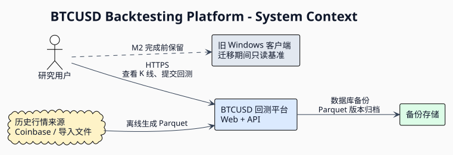
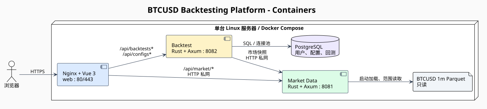
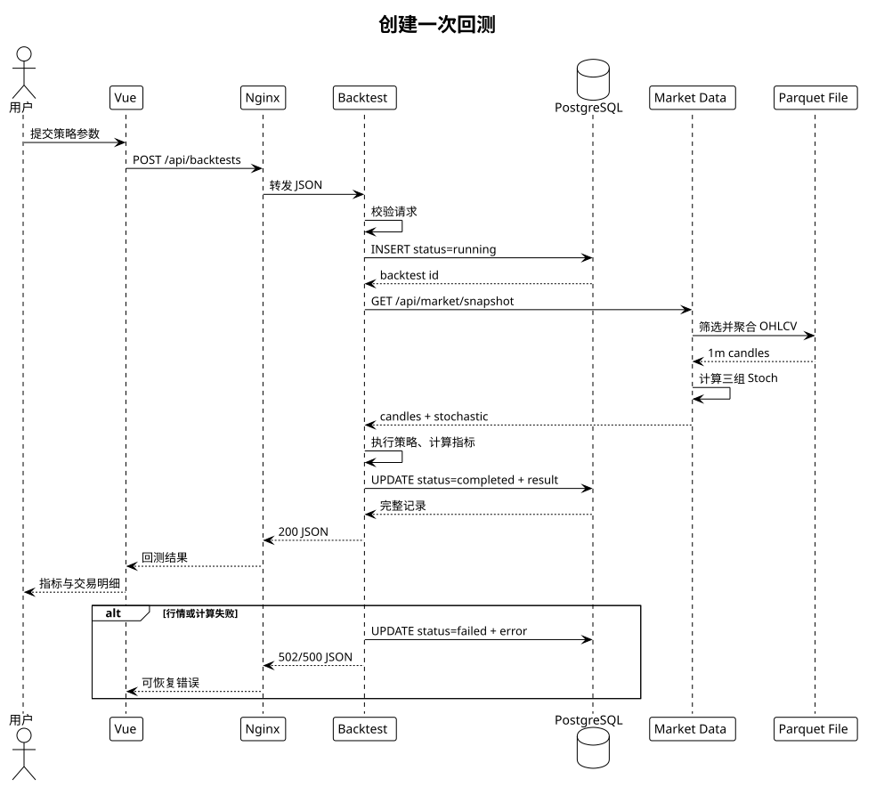

# 系统架构概览

## 目标

系统从本地 Win32 单进程程序迁移为浏览器访问的服务端平台。第一原则是保持部署简单：一台 Linux 服务器、一个 Docker Compose 项目、一个公网入口。服务按业务职责拆分，但首个版本不引入消息队列、服务网格、Kubernetes 或独立 API Gateway。

架构图：[PlantUML 源码](../diagrams/system-context.puml) · [SVG](../diagrams/system-context.svg)

## 容器组成

容器图：[PlantUML 源码](../diagrams/container.puml) · [SVG](../diagrams/container.svg)

| 容器 | 对外端口 | 职责 | 持久化 |
| --- | ---: | --- | --- |
| `web` | `80/443` | HTTPS、Vue 静态资源、同源 API 反代 | TLS 证书只读挂载 |
| `market-data` | 不映射 | 读取 Parquet、聚合 K 线、计算 Stoch | `/data` 只读挂载 |
| `backtest` | 不映射 | 执行回测、保存配置与结果 | 访问 PostgreSQL |
| `postgres` | 不映射 | 用户、策略配置和回测记录 | Docker volume |

浏览器只访问 Nginx。`market-data`、`backtest` 和 PostgreSQL 只在 Compose 内部网络可达。

## 主要数据流

1. 浏览器请求 `/api/market/snapshot`，Nginx 转发到行情服务。
2. 行情服务从启动时加载的 Parquet 数据集中筛选 UTC 时间范围，按请求周期聚合并计算三组 Stoch。
3. 浏览器提交 `/api/backtests`，Nginx 转发到回测服务。
4. 回测服务先写入 `running` 记录，再通过内部 HTTP 获取对齐的 K 线和指标，执行策略并更新为 `completed`；失败则更新为 `failed`。
5. 配置、状态和结果进入 PostgreSQL；K 线始终留在 Parquet，不重复写入数据库。

回测时序图：[PlantUML 源码](../diagrams/backtest-sequence.puml) · [SVG](../diagrams/backtest-sequence.svg)

## 里程碑边界

### M1：服务端最小闭环

- BTCUSD 历史 K 线查询和 9 个周期切换。
- 三组 Stoch 服务端计算和参数调整。
- Stoch 交叉策略回测、手续费、收益、回撤和胜率。
- 策略配置与回测历史持久化。
- Vue 响应式页面、Nginx HTTPS 和 Compose 单机部署。

### M2：旧客户端功能等价

- 播放、暂停、单步、倍速和 UTC 时间同步。
- 项目/回放会话保存、趋势线和 Buy/Sell 标记。
- 同一会话的多周期图表联动。
- 旧 `.replay`、CSV 数据和用户状态迁移工具。

在 M2 验收前，旧客户端保持可构建、只读归档，不宣布完全替代。

## 非目标

- 实时行情、交易所账户连接和真实下单。
- 多币种或任意证券行情。
- Kubernetes、跨主机高可用和自动扩缩容。
- M1 内的公开注册、登录、组织和复杂权限系统。

