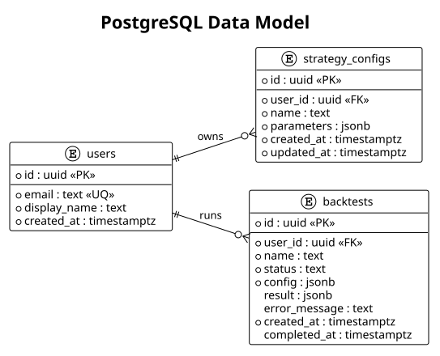

# PostgreSQL Schema

实体关系图：[PlantUML 源码](../diagrams/data-model.puml) · [SVG](../diagrams/data-model.svg)

## `users`

| 字段 | 类型 | 约束 |
| --- | --- | --- |
| `id` | UUID | 主键，默认 `gen_random_uuid()` |
| `email` | TEXT | 唯一、非空 |
| `display_name` | TEXT | 非空 |
| `created_at` | TIMESTAMPTZ | 非空，默认当前时间 |

M1 迁移写入固定本地访客。邮箱 `guest@local.invalid` 不用于登录或通信。

## `strategy_configs`

| 字段 | 类型 | 约束 |
| --- | --- | --- |
| `id` | UUID | 主键 |
| `user_id` | UUID | 外键到 `users`，级联删除 |
| `name` | TEXT | 非空 |
| `parameters` | JSONB | 非空、由 API 校验 |
| `created_at` | TIMESTAMPTZ | 非空 |
| `updated_at` | TIMESTAMPTZ | 非空 |

`parameters` 必须在应用层包含 `length, oversold, overbought`。结构增加 `schema_version` 时保留旧版本读取器。

## `backtests`

| 字段 | 类型 | 约束 |
| --- | --- | --- |
| `id` | UUID | 主键 |
| `user_id` | UUID | 外键到 `users`，级联删除 |
| `name` | TEXT | 非空 |
| `status` | TEXT | `running/completed/failed` |
| `config` | JSONB | 请求的不可变快照 |
| `result` | JSONB | 完成前可空 |
| `error_message` | TEXT | 失败原因，可空 |
| `created_at` | TIMESTAMPTZ | 非空 |
| `completed_at` | TIMESTAMPTZ | 运行中可空 |

索引 `(user_id, created_at DESC)` 支持历史列表。回测配置一经创建不修改，以保证结果可复现。

## 所有权与迁移

- 只有回测服务运行 SQL 迁移并访问这些表。
- 迁移文件只向前追加，不修改已部署的迁移。
- 应用启动时执行迁移；失败则不开始监听端口。
- 数据库备份必须与应用镜像版本、Parquet 文件校验和一起记录。
- M2 的回放状态由未来 `replay` 服务拥有，不能直接追加到回测服务表中。

