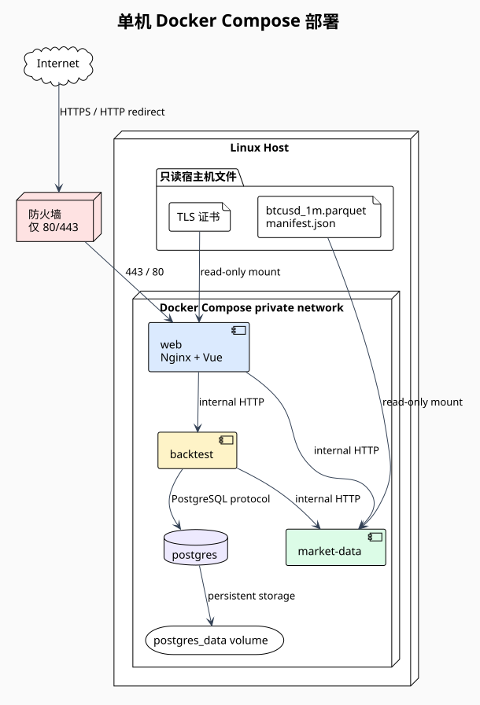

# Docker Compose 与 HTTPS

部署图：[PlantUML 源码](../diagrams/deployment.puml) · [SVG](../diagrams/deployment.svg)



## 主机要求

- 64 位 Linux，Docker Engine 与 Compose 插件。
- 推荐至少 2 CPU、4 GiB 内存和 20 GiB 可用磁盘；完整十年 1 分钟数据需按实际文件增加容量。
- DNS A/AAAA 记录指向服务器，防火墙只开放 TCP `80` 与 `443`。
- 宿主机准备 Parquet、数据清单、环境变量文件和 TLS 证书。

## Compose 资源

- `web` 构建 Vue 静态文件并运行 Nginx，默认映射 `80:80` 和 `443:443`。
- `market-data` 只读挂载 `./data/market:/data:ro`。
- `backtest` 通过 `DATABASE_URL` 和 `MARKET_DATA_URL` 访问内部依赖。
- `postgres` 使用命名 volume，固定主版本，启用健康检查。
- `web` 同时加入公网入口 bridge 和私有后端 bridge；其他容器只加入私有后端 bridge。
- 除 `web` 外不映射宿主机端口。

仓库根目录提供 `docker-compose.yml`，生产部署前先复制 `.env.example` 为 `.env` 并替换 `POSTGRES_PASSWORD`。`.env` 不提交 Git。

## 环境变量

| 名称 | 容器 | 默认/要求 |
| --- | --- | --- |
| `POSTGRES_DB` | postgres | `btcusd` |
| `POSTGRES_USER` | postgres/backtest | `btcusd` |
| `POSTGRES_PASSWORD` | postgres/backtest | 生产必须使用随机密钥，不提交 Git |
| `WEB_HTTP_PORT` | web | 默认 `80`，本机冲突时可改为其他宿主机端口 |
| `WEB_HTTPS_PORT` | web | 默认 `443`，本机冲突时可改为其他宿主机端口 |
| `DATABASE_URL` | backtest | 由 Compose 从上述变量构造 |
| `MARKET_DATA_URL` | backtest | `http://market-data:8081` |
| `MARKET_DATA_PARQUET` | market-data | `/data/btcusd_1m.parquet` |
| `RUST_LOG` | Rust 服务 | 默认 `info` |

`.env.example` 只能包含无敏感默认值；生产 `.env` 权限设为 `0600` 并排除版本控制。

## HTTPS

- HTTP 入口只执行 `301` 重定向到同一主机 HTTPS。
- 生产证书只读挂载为 `/etc/nginx/certs/fullchain.pem` 和 `privkey.pem`；Nginx 启动脚本会把它们链接到运行时目录 `/run/nginx-certs/`。
- 未挂载证书时，容器会生成 7 天有效的 localhost 自签名证书，仅用于本地 Compose 冒烟。
- Nginx 只启用 TLS 1.2/1.3，并设置 HSTS、`X-Content-Type-Options`、`Referrer-Policy` 和最小权限 CSP。
- 本地开发可生成自签名证书；浏览器警告是预期行为，不能把自签名证书用于公网。
- 证书续期由宿主机 Certbot 或同等工具处理；续期后执行 `nginx -s reload`，无需重启后端。

## 配置校验

在没有行情文件和证书的机器上也可以先校验 Compose 语法：

```bash
docker compose config
```

有 `data/market/btcusd_1m.parquet` 后执行完整构建和启动：

```bash
docker compose up -d --build
```

公网入口检查：

```bash
curl -I http://localhost/
curl -k https://localhost/healthz
```

## 发布流程

1. 在 CI 通过 Rust、前端、文档和 Compose 校验。
2. 为应用镜像和 Parquet 文件记录不可变版本/校验和。
3. 备份 PostgreSQL，并确认当前镜像仍可获取。
4. 在服务器拉取指定版本并执行 `docker compose up -d --build`。
5. 依次检查 PostgreSQL、行情服务、回测服务和 Nginx 健康。
6. 运行一条固定参数的冒烟回测，与基准结果比较。

数据库迁移失败、行情文件校验失败或冒烟结果不一致时停止发布并回滚镜像；不得跳过校验继续上线。
